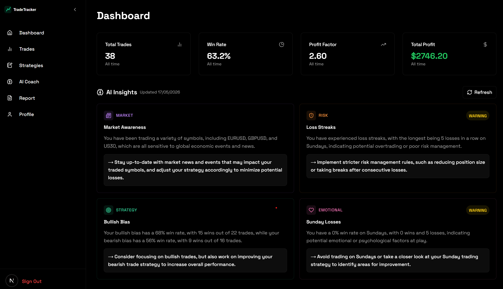

# TradeTracker

TradeTracker is a premium, full-stack trading journal and performance analytics platform built for serious, data-driven traders. Stop guessing why you're losing and start relying on hard data to refine your edge — across Forex, Crypto, Stocks, Indices, Futures, and more.



---

## Key Features

- **Live Performance Analytics** — Real-time tracking of P&L, Win Rate, Profit Factor, and R:R ratio across your entire trade history.
- **Email OTP Authentication** — Secure sign-up flow with 6-digit one-time password email verification. Unverified accounts cannot log in.
- **AI Trading Coach (Llama 3.3)** — Powered by Groq. Automatically analyzes your trade history, identifies behavioral leaks, and generates personalized, actionable insights.
- **AI Chat Interface** — Conversational AI coach that has full context of your trade data for real-time coaching Q&A.
- **Broker-Agnostic CSV Import** — Dynamic column mapper that handles disparate CSV formats from different brokers, with intelligent fallbacks for missing fields.
- **Psychology & Emotional Tracking** — Tag every trade with your emotional state (FOMO, Disciplined, Anxious, etc.) and see how your emotions correlate with your P&L.
- **Strategy Journal** — Define trading strategies with explicit entry/exit rules and risk parameters. Track adherence and individual strategy performance.
- **Economic News Calendar** — Integrated high-impact economic event feed with 1-hour server-side caching.
- **Animated Landing Page** — Built with Framer Motion + 3D parallax tilt, scroll reveals, and a breathing hero section.

---

## Tech Stack

### Frontend
| Technology | Purpose |
|---|---|
| [Next.js 15+](https://nextjs.org/) (App Router) | Framework & routing |
| [React 19](https://react.dev/) | UI library |
| [TypeScript](https://www.typescriptlang.org/) | Type safety |
| [Tailwind CSS](https://tailwindcss.com/) + [Radix UI](https://www.radix-ui.com/) | Styling & primitives |
| [Framer Motion](https://www.framer.com/motion/) | Animations & scroll reveals |
| [react-parallax-tilt](https://github.com/mkosir/react-parallax-tilt) | 3D screenshot tilt effects |
| [Recharts](https://recharts.org/) | Data visualizations |
| [shadcn/ui](https://ui.shadcn.com/) | Component system |

### Backend
| Technology | Purpose |
|---|---|
| [Node.js](https://nodejs.org/) + [Express 5](https://expressjs.com/) | API runtime & framework |
| [Prisma](https://www.prisma.io/) | ORM with PostgreSQL |
| [PostgreSQL](https://www.postgresql.org/) | Primary database |
| [TypeScript](https://www.typescriptlang.org/) | Type safety |
| [Groq SDK](https://groq.com/) | AI inference (Llama 3.3) |
| [Nodemailer](https://nodemailer.com/) | Transactional OTP emails |
| [JWT](https://jwt.io/) + [BcryptJS](https://github.com/dcodeIO/bcrypt.js) | Auth & password hashing |
| [Zod](https://zod.dev/) | Request schema validation |
| [Pino](https://getpino.io/) | Structured JSON logging |
| [express-rate-limit](https://github.com/express-rate-limit/express-rate-limit) | API & auth rate limiting |
| [multer](https://github.com/expressjs/multer) | Multipart file upload (CSV) |

---

## Getting Started

### Prerequisites
- Node.js v18+
- A PostgreSQL database (e.g., [Supabase](https://supabase.com/), [Railway](https://railway.app/), or [Render](https://render.com/))
- A transactional email provider (Gmail App Password, [Resend](https://resend.com/), etc.)
- A [Groq](https://console.groq.com/) API key (free tier available)

### Installation

**1. Clone the repository**
```bash
git clone https://github.com/your-username/trade-tracker.git
cd trade-tracker
```

**2. Setup Backend**
```bash
cd backend
npm install
# Copy the example env and fill in your values
cp .env.example .env
npm run db:push      # Push schema to your database
npm run dev          # Starts on http://localhost:5000
```

**3. Setup Frontend**
```bash
cd ../frontend
npm install
# Create env file and set your backend URL
echo "NEXT_PUBLIC_API_URL=http://localhost:5000" > .env.local
npm run dev          # Starts on http://localhost:3000
```

---

## Environment Variables

### Backend (`/backend/.env`)

```env
DATABASE_URL=         # PostgreSQL connection string
JWT_SECRET=           # Long, random secret for JWT signing
PORT=5000

GROQ_API_KEY=         # From https://console.groq.com

# SMTP — for OTP email verification
SMTP_HOST=smtp.gmail.com
SMTP_PORT=465
SMTP_SECURE=true
SMTP_USER=            # Your email address
SMTP_PASS=            # App Password (not your real password)
```

### Frontend (`/frontend/.env.local`)

```env
NEXT_PUBLIC_API_URL=  # e.g. http://localhost:5000 or your deployed backend URL
```

---

## Project Structure

```
trade-tracker/
├── backend/
│   ├── prisma/
│   │   └── schema.prisma       # Database models
│   └── src/
│       ├── db/                 # Prisma client with connection pool config
│       ├── middleware/         # Auth, validation, error handler, rate limit
│       ├── routes/             # auth, trades, import, ai, news, profile, strategies
│       ├── services/
│       │   ├── ai.ts           # Groq/Llama insight generation & chat
│       │   └── email.ts        # Nodemailer OTP email service
│       └── index.ts            # App entry point
├── frontend/
│   ├── app/
│   │   ├── (auth)/             # Login & Signup pages (OTP flow)
│   │   ├── (main)/dashboard/   # Protected dashboard & sub-pages
│   │   ├── components/         # InsightCards, RecentTrades, NewsWidget, Sidebar
│   │   └── page.tsx            # Animated public landing page
│   ├── middleware.ts            # Next.js route protection
│   └── public/screenshots/     # App screenshots used on landing page
└── sample_trades.csv           # Example CSV for testing the import feature
```

---

## Security

- Passwords hashed with **bcrypt** (cost factor 10)
- JWTs expire after **7 days**, signed with a secret
- Email verified via **6-digit OTP with 10-minute expiry** before login is permitted
- Auth endpoints rate-limited to **15 requests per 15 minutes**
- General API endpoints rate-limited to **100 requests per minute**
- All trade mutations validate **user ownership** before DB writes (no IDOR)
- CSV uploads capped at **5MB** with MIME type validation
- CORS restricted to **known frontend origins only**
- Token stored in **`SameSite=Strict` cookie** (not `localStorage`) to reduce XSS surface

---

*Built for traders who take their edge seriously.*
